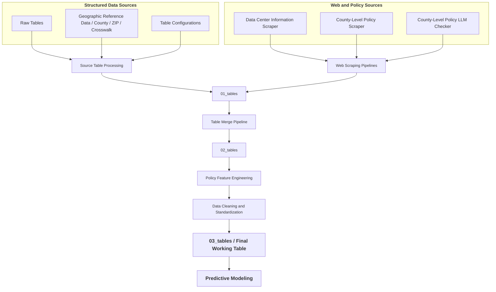

# Data Center Siting Analysis and Predictive Modeling at the County Level

## Project Overview

The project was initially developed as part of a course project and has since been extended to incorporate a broader data pipeline, feature engineering, and predictive modeling framework.

AI growth has made data centers critical infrastructure; rising demand and investment are increasing their role in regional development. This project aims to explore the following research questions:

- **Which U.S. county-level factors (e.g., infrastructure, climate, workforce, economic indicators, and policy) are associated with data center presence?**

- **Can these features be used to build predictive models that identify counties likely to attract future data center development?**

## Data Sources

This project integrates multiple public datasets to construct a county-level dataset for data center site analysis. Detailed dataset metadata and configuration files can be found in [src/configs](src/configs).

| Dataset | Source | Granularity | Vintage | Description |  
|-------|-------|-------------|------------------|--------|  
| [Electricity Indicators](https://data.openei.org/submissions/6225) | OEDI | ZIP Code | 2023 | Electricity price indicators based on ownership and utility function |
| [Environmental Risk Indicators](https://resilience.climate.gov/datasets/FEMA::national-risk-index-counties/about) | CMRA | County | 2025 | Environmental risk indices capturing exposure to multiple natural hazards |
| [Grid Indicators](https://www.energy.gov/media/302989) | DOE | County-FIPS | 2023 | Employment counts across various energy sectors |
| [Broadband Indicators](https://broadbandmap.fcc.gov/data-download/nationwide-data?pubDataVer=dec2023) | FCC | County-FIPS | 2023 | Broadband coverage rates by technology type and speed tier |
| [Labor Cost Indicators](https://www.bls.gov/cew/downloadable-data-files.htm) | BLS | County | 2023 | Average annual wages by ownership type and industry sector |
| [Land Price Indicators](https://www.aei.org/housing/land-price-indicators/) | AEI | County-FIPS | 2012-2023 | Land value estimates over time |
| [Transportation Accessibility Indicators](https://www.bts.gov/ctp) | BTS | County | 2024 | Indicators measuring the availability and quality of transportation infrastructure |
| [Zip-County Crosswalk](https://www.huduser.gov/portal/datasets/usps_crosswalk.html) | PD&R | County-FIPS & ZIP Code | 2025 | Address-based allocation ratios linking ZIP codes to counties |
| [County FIPS Code and Name Mapping](https://www.census.gov/geographies/reference-files/2024/demo/popest/2024-fips.html) | USCB | County-FIPS | 2024 | Reference table used to align datasets using county FIPS codes |

- **Data Center Locations**: Collected through a custom web scraping pipeline that aggregates publicly available information on data center facilities.

- **County-Level Policy Information**: Collected via web scraping from public policy sources and validated using an LLM-assisted human-in-the-loop review process.

## Data Pipelines

### Data Collection and Integration

The pipeline shown below summarizes how multiple data sources are processed and integrated into a unified dataset. Raw datasets from various sources are collected, cleaned, and transformed into structured tables, while web-scraped information is organized into standardized datasets through dedicated scripts.

These intermediate tables are subsequently merged into a final county-level working table, which serves as the primary dataset for downstream feature engineering and predictive modeling.

Implementation details for each stage of the pipeline can be found in the [scripts](scripts) directory.

## Feature Engineering

## Target Variable

## Working Table

## Next Steps

- EDA: Ongoing

## Reference

- Kearney. (2025). *[AI Data Center Location Attractiveness Index](https://www.kearney.com/industry/technology/article/ai-data-center-location-attractiveness-index)*
- IBM. (2025). *[What is an AI Data Center](https://www.ibm.com/think/topics/ai-data-center)*
- Epoch AI, ‘Frontier Data Centers’. Published online at epoch.ai. Retrieved from ‘[https://epoch.ai/data/data-centers’](https://epoch.ai/data/data-centers’) [online resource]. Accessed 21 Jan 2026.

