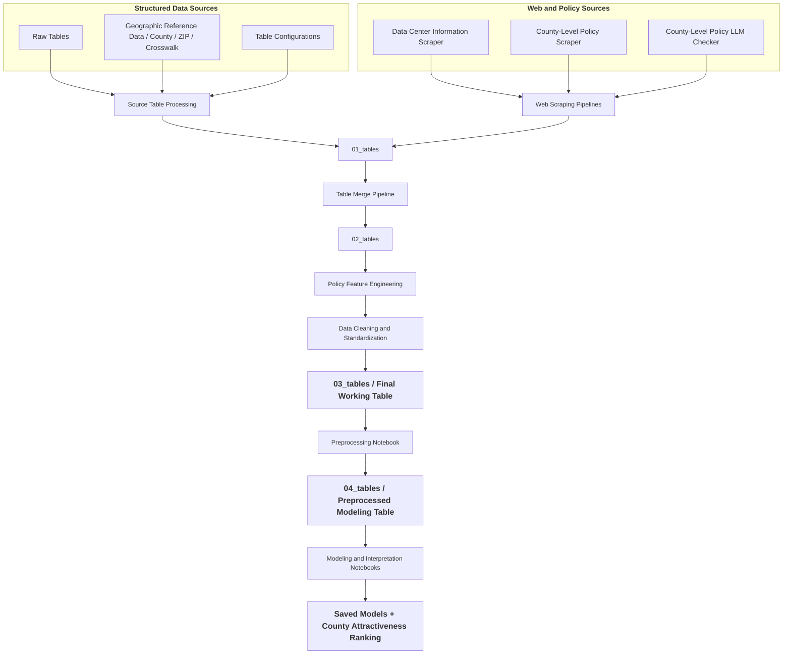

# Data Center Siting Analysis and Predictive Modeling at the County Level

## Project Overview

The project was initially developed as part of a course project and has since been extended to incorporate a broader data pipeline, feature engineering, preprocessing, and predictive modeling framework.

AI growth has made data centers critical infrastructure; rising demand and investment are increasing their role in regional development. This project aims to explore the following research questions:

- **Which U.S. county-level factors (e.g., infrastructure, climate, workforce, economic indicators, and policy) are associated with data center presence?**

- **Can these features be used to build predictive models that identify counties likely to attract future data center development?**

The full analysis pipeline — from raw data to county-level attractiveness rankings — is implemented across five Jupyter notebooks. The primary model is a **two-part hurdle model** (Option 2) using LightGBM, with SHAP-based interpretation separating the drivers of *presence* from the drivers of *scale*.

## Repository Structure

```text
project-root
│
├── data_revealed/               # intermediate and final datasets produced by pipelines
│   ├── 01_tables/               # initial processed tables
│   ├── 02_tables/               # merged / transformed tables
│   ├── 03_tables/               # final raw working table (pre-preprocessing)
│   └── 04_tables/               # preprocessed modeling table and model outputs
│       ├── county_preprocessed.csv           # 3,138 counties × 42 cols, zero nulls
│       └── county_attractiveness_ranking.csv # all counties ranked by model score
│
├── notebooks/                   # analysis notebooks (run in order)
│   ├── eda.ipynb                # exploratory data analysis
│   ├── preprocessing.ipynb      # feature preprocessing pipeline
│   ├── modeling_option1_tweedie.ipynb  # Option 1: single LightGBM Tweedie model
│   ├── modeling_option2_hurdle.ipynb   # Option 2: two-part hurdle model (primary)
│   └── interpretation.ipynb    # SHAP interpretation and county ranking
│
├── models/                      # serialized trained models
│   ├── option1_tweedie.joblib   # LGBMRegressor (Tweedie, p=1.3)
│   └── option2_hurdle.joblib    # LGBMClassifier (Stage 1) + LGBMRegressor (Stage 2)
│
├── scripts/                     # executable data pipelines and transformation scripts
│   ├── 00_*.py                  # build tables from original data sources and collect web-scraped data
│   ├── 01_*.py                  # transform datasets to consistent geographic granularity (state / county / county_fips)
│   ├── 02_*.py                  # combine county-level tables and policy data
│   └── 03_*.py                  # construct and clean the final working table
│
├── src/                         # reusable pipeline modules and transformation logic
│
├── tests/                       # unit tests for functions in src/
│
├── queries.txt                  # queries used for policy scraping
├── requirements.txt             # project dependencies
├── run_states.sh                # helper script for running state-level scraping jobs
├── .gitignore
└── README.md
```

## Data Sources

This project integrates multiple public datasets to construct a county-level dataset for data center site analysis. Detailed dataset metadata and configuration files can be found in [src/configs](src/configs).

| Dataset | Source | Granularity | Vintage | Description |  
|-------|-------|-------------|------------------|--------|  
| [Electricity Indicators](https://data.openei.org/submissions/6225) | OEDI | ZIP Code | 2023 | Electricity price indicators based on ownership and utility function |
| [Environmental Risk Indicators](https://resilience.climate.gov/datasets/FEMA::national-risk-index-counties/about) | CMRA | County | 2025 | Environmental risk indices capturing exposure to multiple natural hazards |
| [Grid Indicators](https://www.energy.gov/media/302989) | DOE | County-FIPS | 2023 | Employment counts across various energy sectors |
| [Broadband Indicators](https://broadbandmap.fcc.gov/data-download/nationwide-data?pubDataVer=dec2023) | FCC | County-FIPS | 2023 | Broadband coverage rates by technology type and speed tier |
| [Labor Cost Indicators](https://www.bls.gov/cew/downloadable-data-files.htm) | BLS | County | 2023 | Average annual wages by ownership type and industry sector |
| [Land Price Indicators](https://www.aei.org/housing/land-price-indicators/) | AEI | County-FIPS | 2012-2023 | Land value estimates over time |
| [Transportation Accessibility Indicators](https://www.bts.gov/ctp) | BTS | County | 2024 | Indicators measuring the availability and quality of transportation infrastructure |
| [Zip-County Crosswalk](https://www.huduser.gov/portal/datasets/usps_crosswalk.html) | PD&R | County-FIPS & ZIP Code | 2025 | Address-based allocation ratios linking ZIP codes to counties |
| [County FIPS Code and Name Mapping](https://www.census.gov/geographies/reference-files/2024/demo/popest/2024-fips.html) | USCB | County-FIPS | 2024 | Reference table used to align datasets using county FIPS codes |

- **Data Center Locations**: Collected through a custom web scraping pipeline that aggregates publicly available information on data center facilities.

- **County-Level Policy Information**: Collected via web scraping from public policy sources and validated using an LLM-assisted human-in-the-loop review process.

## Data Pipelines

### Data Collection and Integration

The pipeline shown below summarizes how multiple data sources are processed and integrated into a unified dataset. Raw datasets from various sources are collected, cleaned, and transformed into structured tables, while web-scraped information is organized into standardized datasets through dedicated scripts.

These intermediate tables are subsequently merged into a final county-level working table, which serves as the primary dataset for downstream feature engineering and predictive modeling.

Implementation details for each stage of the pipeline can be found in the [scripts](scripts) directory.



- **Additional Notes: ZIP-to-County Transformation Logic**

A ZIP–county crosswalk table (not included in this repository) is used to map ZIP codes to counties. The table provides a `business_ratio` field representing the share of business addresses associated with each county within a ZIP code. This ratio is used as the weighting factor when aggregating ZIP-level features to the county level.

Although the crosswalk table also contains `residential_ratio` and `other_ratio`, only `business_ratio` is used in this project. This choice is motivated by the commercial and utility-intensive nature of data centers. As a result, when transforming ZIP-level datasets (such as the number of data centers per ZIP code and commercial or industrial electricity prices) into county-level features, `business_ratio` is applied as the aggregation weight.

## Target Variable

The target variable is constructed through the following sequential steps:


The resulting variable represents an estimated signal of data center presence at the county level. Although fractional values may appear due to the ZIP–county mapping process, the variable serves as a proxy for the relative number of data centers in each county and is used as the target variable for this project.

The detailed transformation logic used to construct the final indicator is documented in [script](scripts/01_pipeline_zip_to_county_num_dc.py).

The target exhibits two structural properties that jointly motivate the modeling choices:

- **Zero inflation**: ~75.6% of the 3,138 counties have zero data centers. This is not a sampling artifact — it reflects genuine geographic concentration.
- **Right-skewed positive tail**: among the 24.4% of counties with at least one data center, the distribution is extremely right-skewed (range: near-zero to ~700, with Loudoun County, VA as the dominant outlier).

## Feature Engineering

The following section focuses on engineered features constructed from different analytical perspectives. Features directly taken from raw tables are not included.

### Grid infrastructure and clean energy (source: `grid_infrastructure` in [configuration script](src/configs/sources_county_fips.py))

- **`clean_energy_jobs`**  
  - **Source columns:** `Solar`, `Wind`, `Hydroelectric`.  
  - **Method:** Sum of three employment counts after special-value handling (`"<10"` → 5).  
  - **Logic:** Proxies the scale of renewable generation and clean‑energy workforce in a county, which affects the availability of low‑carbon power and potential for PPAs.

- **`grid_infrastructure_jobs`**  
  - **Source columns:** `Traditional TDS`, `Storage`, `Smart Grid`, `Micro Grid`.  
  - **Method:** Sum of four employment counts.  
  - **Logic:** Captures the maturity and capacity of transmission/distribution/storage infrastructure and the associated workforce, signaling grid reliability and upgrade potential.

### Broadband and network connectivity (source: `high_speed_internet` in [configuration script](src/configs/sources_county_fips.py))

Base columns are pivoted by technology (Fiber, Cable/Fiber, Any Technology) and speed thresholds, then used to construct:

- **`fiber_100_20_coverage`, `fiber_1000_100_coverage`, `cable_fiber_*`, `any_tech_*`**  
  - **Source columns:** `speed_100_20`, `speed_1000_100` by technology.  
  - **Method:** Pivot to wide format; coverage values represent the share of business locations meeting each speed/technology combination.  
  - **Logic:** Describe how widely high‑speed fixed broadband is available to business locations in each county.

- **`fiber_availability`**  
  - **Source column:** `fiber_1000_100_coverage`.  
  - **Method:** Directly re‑used as a proxy feature.  
  - **Logic:** A single scalar indicating whether 1 Gbps+ fiber coverage exists for business locations—critical for large‑scale data center connectivity (low latency, high bandwidth, redundancy).

- **`high_speed_wired_coverage`**  
  - **Source column:** `cable_fiber_1000_100_coverage`.  
  - **Method:** Directly re‑used as a proxy feature.  
  - **Logic:** Summarizes wired high‑speed coverage (fiber or cable), capturing general high‑bandwidth connectivity for the county.

### Transportation and physical infrastructure (source: `transportation` in [configuration script](src/configs/sources_county.py))

Starting from counts of airports by FAA class, rail track length, and dock/port counts, the pipeline constructs:

- **`air_connectivity`**  
  - **Source columns:** `primary_large_airport_count`, `primary_medium_airport_count`, `primary_small_airport_count`, `non_hub_primary_airport_count`, `national_non_primary_airport_count`, `regional_non_primary_airport_count`, `local_non_primary_airport_count`, `basic_non_primary_airport_count`, `unclassified_non_primary_airport_count`.  
  - **Method:** Weighted sum across airport types using FAA‑inspired weights (e.g., Large=5, Medium=4, Small=3, etc.), then `log1p` transform.  
  - **Logic:** Produces a single index of airport scale and availability, emphasizing larger airports while still capturing smaller facilities; log transform tempers the dominance of major hubs.

- **`rail_intensity`**  
  - **Source column:** `rail_track_count` (from `All Rail Track`).  
  - **Method:** `log1p(rail_track_count)`.  
  - **Logic:** Measures the intensity of rail infrastructure in a county while reducing the impact of outliers. Relevant for heavy industrial logistics and equipment delivery.

- **`infrastructure_quality`**  
  - **Source columns:** `infra_good_count`, `infra_fair_count`, `infra_poor_count` (aggregated from `Good`, `Fair`, `Poor`).  
  - **Method:** `(Good + 0.5 * Fair) / (Good + Fair + Poor)` when the denominator is > 0.  
  - **Logic:** A weighted index of infrastructure condition that rewards "Good" more than "Fair" and penalizes "Poor", providing a continuous measure of infrastructure health.

- **`dock_presence`**  
  - **Source column:** `docks_count` (from `Docks`).  
  - **Method:** Binary indicator: 1 if `docks_count > 0`, else 0.  
  - **Logic:** Encodes structural access to navigable water (ports, docks) relevant for certain data center designs and industrial co‑location; zeros are treated as structural (landlocked) rather than missing.

### Environmental risk indices (source: `environment_risk` in [configuration script](src/configs/sources_county.py))

The National Risk Index table is used mostly as‑is, but it is conceptually engineered into a county‑level hazard profile:

- **Core features:** `community_resilience_value`, `community_risk_factor_value`, and per‑hazard risk indices (e.g., `cold_wave_risk_index_value`, `drought_risk_index_value`, `earthquake_risk_index_value`, `hail_risk_index_value`, `heat_wave_risk_index_value`, `hurricane_risk_index_value`, `ice_storm_risk_index_value`, `landslide_risk_index_value`, etc).  
- **Method:** Read as continuous indices from the National Risk Index and joined at the county level.  
- **Logic:** Together these form a multi‑hazard risk profile, capturing climate and natural‑hazard exposure for long‑lived infrastructure like data centers.

### Land cost proxy (source: `land_price` in [configuration script](src/configs/sources_county_fips.py))

- **`land_value_1_4_acre_standardized`**  
  - **Source column:** `Land Value (1/4 Acre Lot, Standardized)` filtered to year 2023.  
  - **Method:** Extracted for each county FIPS and standardized by the source provider.  
  - **Logic:** Serves as a proxy for commercial/urban land cost, approximating the price of a small standardized lot (dollar-denominated per 1/4-acre unit normalization, not a z-score). Higher values imply more expensive land for siting.

### Labor cost indicators (source: `labor_price` in [configuration script](src/configs/sources_county.py))

The BLS wage table is pivoted from long format (Industry as rows) into wide format, yielding:

- **`wage_trade_transport_utilities`**  
  - **Source:** Industry `1021 Trade, transportation, and utilities`.  
  - **Method:** Pivot with `Annual Average Weekly Wage` as the value; rename the resulting column.  
  - **Logic:** Captures typical weekly wages in sectors closely related to logistics and utilities.

- **`wage_information`**  
  - **Source:** Industry `1022 Information`.  
  - **Method:** Same pivot as above.  
  - **Logic:** Represents labor cost in information and media sectors; a proxy for the cost of skilled IT/communications labor.

- **`wage_prof_business`**  
  - **Source:** Industry `1024 Professional and business services`.  
  - **Method:** Same pivot as above.  
  - **Logic:** Captures wage levels for professional and business services, which overlaps with the talent pool relevant for data center operations and engineering.

### Policy features (`has_policy_signal`, `policy_direction_score`)

The final policy features in the working table come from a **search → LLM check → aggregate** pipeline; they are not from a single raw table.

1. **Search and candidate extraction**  
   A set of search queries (e.g. "data center county moratorium", "data center county zoning") is run (see `queries.txt`). Organic search results are collected, and county names are extracted from titles and snippets using a "*Name* County" pattern. This yields a list of candidate (county, state) pairs with supporting URLs.

2. **LLM check**  
   For each unique URL, the pipeline fetches page text (or uses cached snippets) and calls an LLM to classify:
   - **`is_data_center_policy`:** whether the page describes a data-center-related policy (ordinance, moratorium, zoning, etc.).
   - **`support_data_center_siting`:** support direction — `true` (support), `false` (oppose), or `neutral`.
   - **`mentioned_state`**, **`mentioned_county`:** geographic entities mentioned in the text.

   Results are stored per URL (e.g. in `county_candidates_llm_check.json` / `.csv`).

3. **Cleaning and aggregation**  
   The LLM-output table is cleaned ([`00_llm_check_csv_clean.py`](scripts/00_llm_check_csv_clean.py)):
   - Rows with missing state or county are dropped; state and county names are normalized (full state name, "*Name* County" form).
   - `support_data_center_siting` is mapped to numeric: **1** (support), **-1** (oppose), **0** (neutral).
   - Only rows with **`is_data_center_policy == true`** are kept (these are the "policy" rows).
   - The table is aggregated to **one row per (state, county)**:
     - **`has_policy_signal`** = 1 for every such county (since only counties with at least one policy mention remain).
     - **`policy_direction_score`** = mean of the numeric support values over all mentions of that county (range −1 to 1; 0 = neutral or mixed).

## Preprocessing

The preprocessing notebook (`notebooks/preprocessing.ipynb`) transforms the raw working table (`data_revealed/03_tables/county_final_table_clean.csv`, 3,149 rows × 41 cols) into a clean modeling-ready table (`data_revealed/04_tables/county_preprocessed.csv`, 3,138 rows × 42 cols, zero nulls).

Key decisions made during preprocessing:

| Step | Decision | Rationale |
|---|---|---|
| Join key | `county_key = state \|\| county` | 3 counties have placeholder FIPS codes; the composite string key is always unique |
| Broadband columns | Drop 4 redundant coverage cols (`any_tech_100_20`, `cable_fiber_100_20`, `fiber_100_20`, `high_speed_wired`) | Highly collinear with retained cols; remove redundancy before modeling |
| Suppression floor indicators | Add `*_above_floor` binary for `epg_natural_gas` (floor=5), `clean_energy_jobs` (floor=15), `grid_infrastructure_jobs` (floor=20) | BEA/EIA disclosure suppression assigns a fixed minimum to counties below the threshold; flag captures the real discontinuity |
| Land value | Convert 23 negative values to NaN, add `land_value_missing` flag, impute with median | Negative dollar-denominated land values are assessor data artifacts, not valid observations |
| Electricity prices | Convert zeros and values below $0.01/kWh to NaN, impute with median | 15+ counties had exact-zero or near-zero prices from unreliable utility reporting |
| `dock_presence` | Keep as binary (0/1); exclude from `log1p` | The column is already binary; `log1p(1) = 0.693` is a pointless rescaling |
| `log1p` transform | Apply to 24 continuous features (all NRI risk indices, energy/jobs counts, wages, prices, land value, air connectivity) | Right-skewed distributions; tree splits on rank order are more stable after compression |
| `state` | Excluded from feature matrix | Geographic label that would absorb variance belonging to structural features (grid, wages, prices) |

## Modeling

Two modeling approaches are implemented and compared. Both use LightGBM as the base learner and the same 80/20 stratified train/test split (`random_state=42`, stratified on `y > 0`).

### Option 1: Single LightGBM Tweedie (`notebooks/modeling_option1_tweedie.ipynb`)

A single LightGBM regressor with the Tweedie objective (`1 < p < 2`) jointly models zero inflation and the right-skewed positive tail. The variance power `p` is tuned via 5-fold cross-validation.

**Best `p` = 1.3** (compound Poisson-Gamma regime, selected from grid {1.1, …, 1.9}).

### Option 2: Two-Part Hurdle Model — Primary (`notebooks/modeling_option2_hurdle.ipynb`)

Decomposes the prediction into two stages:

```
E[y | X]  =  P(y > 0 | X)  ×  E[y | y > 0, X]
              ──────────────    ─────────────────
               Stage 1            Stage 2
           LGBMClassifier      LGBMRegressor
           (binary, AUC)       (Tweedie, p=1.8)
```

- **Stage 1** — trained on all 3,138 counties; `is_unbalance=True` handles the 75/25 class split.
- **Stage 2** — trained only on the 767 positive counties; best Tweedie `p = 1.8` (Gamma-like regime, no zero inflation in the positive subset).

The hurdle model is the **primary model** for this project because it produces separate SHAP interpretations for *presence* and *scale* — the central analytical goal.

### Performance Comparison

| Metric | Option 1 (Tweedie) | Option 2 (Hurdle) |
|---|---|---|
| Tweedie deviance (p=1.3) | 1.756 | 1.965 |
| MAE (log1p scale) | 0.312 | **0.279** |
| RMSE (log1p scale) | **0.474** | 0.524 |
| AUC (has any DC) | 0.807 | **0.833** |
| Median AE (raw scale) | 0.185 | **0.052** |
| Stage 1 AUC | — | **0.847** |
| Stage 1 Avg Precision | — | **0.701** |

Option 2 achieves better presence discrimination (AUC +2.6 pp) and substantially lower median error on raw counts (0.052 vs 0.185), at the cost of slightly higher RMSE on the log scale. The principal advantage of Option 2 is interpretive: separate SHAP values for each stage.

## Model Interpretation

The interpretation notebook (`notebooks/interpretation.ipynb`) loads `models/option2_hurdle.joblib` and computes SHAP values (via `TreeExplainer`) on the held-out test set. Key findings:

### What drives data center PRESENCE (Stage 1)

| Rank | Feature | Direction | Interpretation |
|---|---|---|---|
| 1 | `clean_energy_jobs` | ↑ above floor | Counties with a real clean-energy sector are far more likely to have DCs |
| 2 | `grid_infrastructure_jobs` | ↑ above floor | Grid infrastructure employment signals power capacity |
| 3 | `land_value_1_4_acre_standardized` | ↑ positive | High land values proxy economic density, not just cost |
| 4 | `wage_information` | ↑ positive | Existing IT labor market is a presence prerequisite |
| 5–8 | NRI hazard indices (lightning, hurricane, tornado, heat) | ↑ positive | **Geographic confounders** — co-occur with Southeast/Mid-Atlantic DC hubs, not causal |

### What drives data center SCALE (Stage 2)

| Rank | Feature | Direction | Interpretation |
|---|---|---|---|
| 1 | `wage_information` | ↑ positive | **Agglomeration**: deeper IT talent attracts more facilities |
| 2 | `grid_infrastructure_jobs` | ↑ above floor | Consistent grid capacity signal across both stages |
| 3 | `clean_energy_jobs` | ↑ positive | Clean energy availability enables larger DC clusters |
| 4 | `commercial_price` | varies | Electricity cost sensitivity rises at scale |
| 5+ | NRI hazard indices | largely absent | Drop from top-10 presence → bottom-third for scale |

### Key divergences between stages

- **Hazard risk indices** (hurricane, cold wave, heat wave, earthquake) rank in the top 10 for presence but fall to ranks 20–30 for scale — confirming these are geographic confounders, not causal drivers.
- **`wage_information`** rises from rank 4 (presence) to rank 1 (scale) — the clearest agglomeration signal in the data.
- **`commercial_price`** rises from rank 9 (presence) to rank 4 (scale) — electricity cost becomes a competitive differentiator among counties that already have DCs.
- **Broadband coverage rates** (`fiber_availability`, `any_tech_1000_100_coverage`) rank outside the top 20 in both stages — coverage is near-universal at the county level and does not discriminate between counties.

## Outputs

| File | Description |
|---|---|
| `data_revealed/04_tables/county_preprocessed.csv` | 3,138 × 42 modeling-ready table, zero nulls |
| `data_revealed/04_tables/county_attractiveness_ranking.csv` | All 3,138 counties ranked by `P(has DC) × E[scale]` |
| `models/option1_tweedie.joblib` | Serialized Option 1 model (LGBMRegressor, p=1.3) |
| `models/option2_hurdle.joblib` | Serialized Option 2 models (Stage 1 classifier + Stage 2 regressor) |

**Top 5 counties by attractiveness score** (from the ranking output):

| Rank | County | State | Score |
|---|---|---|---|
| 1 | Loudoun County | Virginia | 17.79 |
| 2 | Maricopa County | Arizona | 16.77 |
| 3 | Cook County | Illinois | 16.45 |
| 4 | Dallas County | Texas | 16.44 |
| 5 | Harris County | Texas | 16.32 |

## Working Table

The raw working table before preprocessing can be found here: [Final Working Table](data_revealed/03_tables/county_final_table_clean.csv).

| Feature | Description |
|--------|-------------|
| `county_fips` | 5-digit state+county FIPS code (string). |
| `state` | State name (full name, e.g. Alabama). |
| `county` | County name (e.g. Autauga County). |
| `epg_natural_gas` | Natural gas electric power generation employment (county). Source: grid_infrastructure. |
| `clean_energy_jobs` | Sum of solar, wind, and hydroelectric employment. Proxies renewable power and clean-energy workforce. Source: grid_infrastructure. |
| `grid_infrastructure_jobs` | Sum of traditional TDS, storage, smart grid, and micro grid employment. Proxies grid maturity and workforce. Source: grid_infrastructure. |
| `any_tech_1000_100_coverage` | Share of business locations with any technology at ≥1000/100 Mbps (1 Gbps+). Source: high_speed_internet. |
| `any_tech_100_20_coverage` | Share of business locations with any technology at ≥100/20 Mbps. Source: high_speed_internet. |
| `cable_fiber_100_20_coverage` | Share of business locations with cable/fiber at ≥100/20 Mbps. Source: high_speed_internet. |
| `fiber_100_20_coverage` | Share of business locations with fiber at ≥100/20 Mbps. Source: high_speed_internet. |
| `fiber_availability` | Fiber coverage at 1 Gbps+ (same as fiber_1000_100_coverage). Proxy for high-bandwidth fiber. Source: high_speed_internet. |
| `high_speed_wired_coverage` | Cable/fiber coverage at 1 Gbps+. Proxy for wired high-speed connectivity. Source: high_speed_internet. |
| `land_value_1_4_acre_standardized` | Standardized land value for a 1/4-acre lot (2023). Proxy for land cost. Source: land_price. |
| `commercial_price` | County-level average commercial electricity price ($/kWh), allocated from ZIP-level rates using business_ratio. Source: ZIP electricity_price → county allocation. |
| `industrial_price` | County-level average industrial electricity price ($/kWh), allocated from ZIP-level rates using business_ratio. Source: ZIP electricity_price → county allocation. |
| `num_datacenters` | County-level allocated data center count (sum of ZIP count × business_ratio). May be fractional (expected count). Source: datacenter counts → ZIP table → county allocation. |
| `air_connectivity` | Weighted index of airport availability by FAA hierarchy, log1p-transformed. Source: transportation. |
| `rail_intensity` | log1p(rail track count). Source: transportation. |
| `infrastructure_quality` | Weighted condition index: (Good + 0.5×Fair) / (Good + Fair + Poor). Source: transportation. |
| `dock_presence` | Binary: 1 if county has at least one dock/port, else 0. Source: transportation. |
| `community_resilience_value` | National Risk Index community resilience value. Source: environment_risk. |
| `community_risk_factor_value` | National Risk Index community risk factor value. Source: environment_risk. |
| `cold_wave_risk_index_value` | NRI cold wave hazard risk index value. Source: environment_risk. |
| `drought_risk_index_value` | NRI drought hazard risk index value. Source: environment_risk. |
| `earthquake_risk_index_value` | NRI earthquake hazard risk index value. Source: environment_risk. |
| `hail_risk_index_value` | NRI hail hazard risk index value. Source: environment_risk. |
| `heat_wave_risk_index_value` | NRI heat wave hazard risk index value. Source: environment_risk. |
| `hurricane_risk_index_value` | NRI hurricane hazard risk index value. Source: environment_risk. |
| `ice_storm_risk_index_value` | NRI ice storm hazard risk index value. Source: environment_risk. |
| `landslide_risk_index_value` | NRI landslide hazard risk index value. Source: environment_risk. |
| `lightning_risk_index_value` | NRI lightning hazard risk index value. Source: environment_risk. |
| `riverine_flooding_risk_index_value` | NRI riverine flooding hazard risk index value. Source: environment_risk. |
| `strong_wind_risk_index_value` | NRI strong wind hazard risk index value. Source: environment_risk. |
| `tornado_risk_index_value` | NRI tornado hazard risk index value. Source: environment_risk. |
| `wildfire_risk_index_value` | NRI wildfire hazard risk index value. Source: environment_risk. |
| `winter_weather_risk_index_value` | NRI winter weather hazard risk index value. Source: environment_risk. |
| `wage_trade_transport_utilities` | Annual average weekly wage, private sector, trade/transportation/utilities (BLS industry 1021). Source: labor_price. |
| `wage_information` | Annual average weekly wage, private sector, information (BLS industry 1022). Source: labor_price. |
| `wage_prof_business` | Annual average weekly wage, private sector, professional and business services (BLS industry 1024). Source: labor_price. |
| `has_policy_signal` | Binary: 1 if the county has at least one observed data-center policy signal (e.g. ordinance, moratorium), 0 otherwise. From LLM-checked search results. |
| `policy_direction_score` | Mean of support direction over mentions: 1 = support, -1 = oppose, 0 = neutral. Range [-1, 1]. From LLM-checked policy snippets. |

## Reference

- Kearney. (2025). *[AI Data Center Location Attractiveness Index](https://www.kearney.com/industry/technology/article/ai-data-center-location-attractiveness-index)*
- IBM. (2025). *[What is an AI Data Center](https://www.ibm.com/think/topics/ai-data-center)*
- Epoch AI, 'Frontier Data Centers'. Published online at epoch.ai. Retrieved from '[https://epoch.ai/data/data-centers'](https://epoch.ai/data/data-centers') [online resource]. Accessed 21 Jan 2026.
